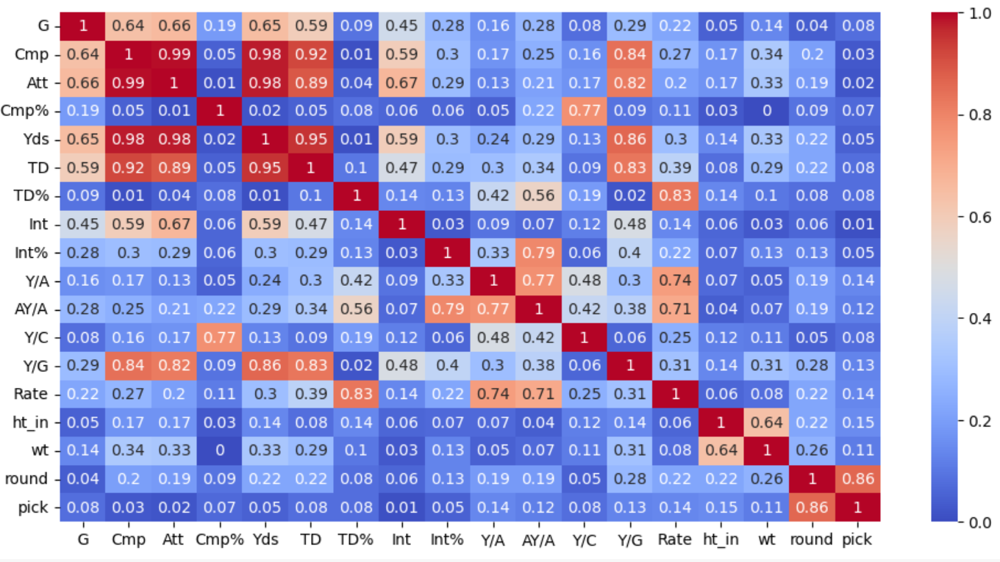
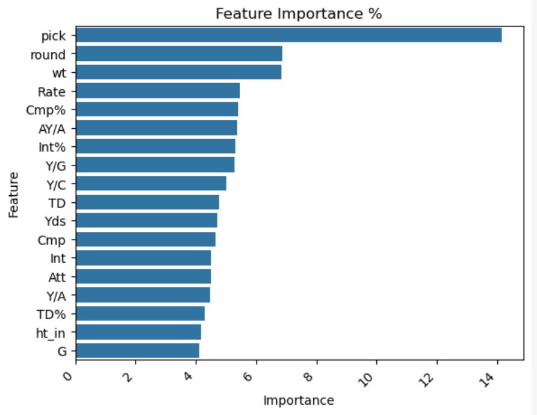
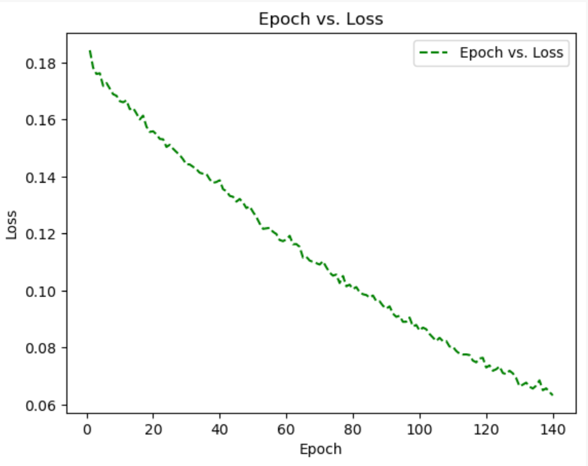
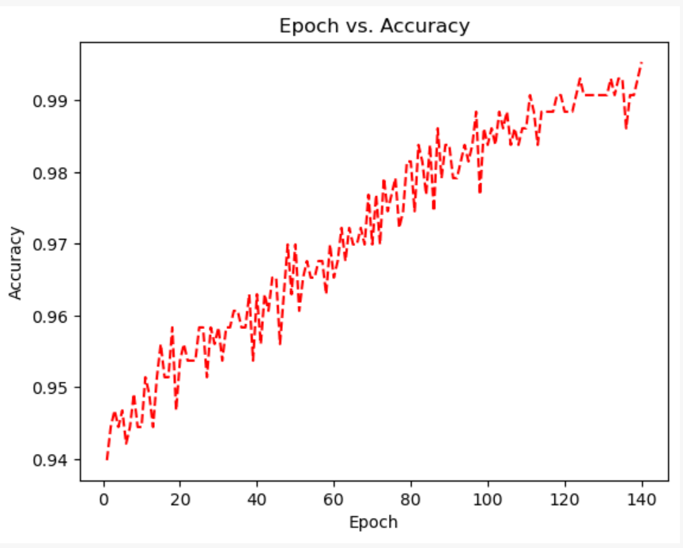
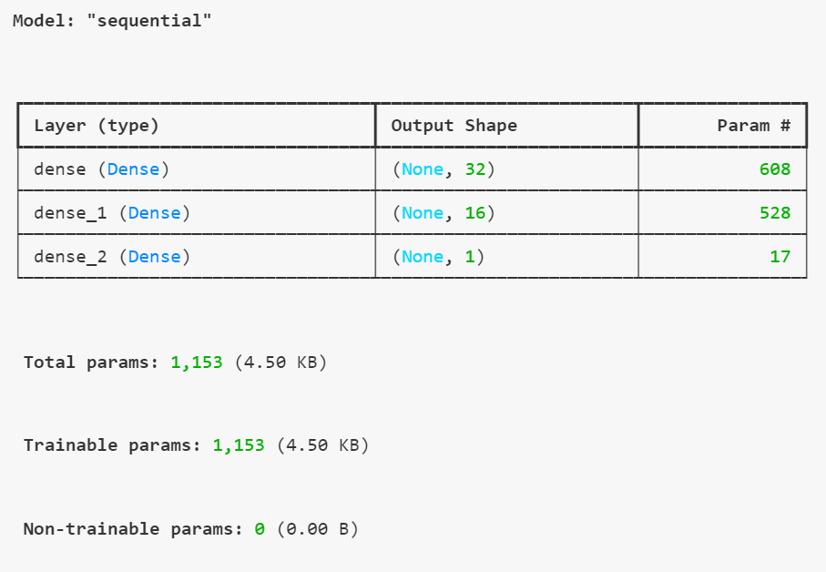
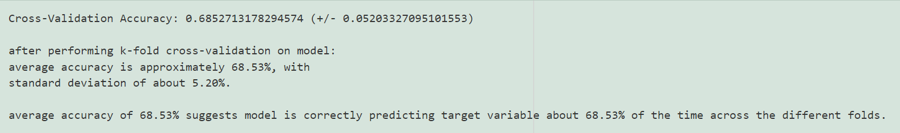

# Predicting the Success of NFL Quarterbacks

*This project aims to predict the success of NFL quarterbacks based on college performance, pre-draft rankings, and NFL statistics. The main focus is on using college football statistics (X Features) to predict NFL career success (y Target), including metrics such as Hall of Fame induction, career longevity, and key statistical achievements.*

**[Data Sourcing](#data-sourcing-summary)** | **[Data Cleaning](#data-cleaning-and-organization)** | **[Modeling](#modeling)** | **[Results](#results)** | **[Future Work](#future-updates-to-this-model)**

---

## Abstract

This project develops machine learning models to predict NFL quarterback success based on college performance metrics. Using data scraped from sources like DraftHistory.com, Pro Football Reference, and Sports-Reference.com, the project combines college and NFL statistics to create a comprehensive dataset. Models such as Logistic Regression, Random Forest, and a basic Neural Network were trained to predict success metrics. Feature importance, cross-validation, and hyperparameter tuning were used to optimize model performance.

## Core Technologies, Tools

* **Languages/Tools** : Python, Jupyter Notebook
* **Libraries** : `requests`, `BeautifulSoup`, `pandas`, `scikit-learn`, `seaborn`, `matplotlib`, `pickle`
* **Data Handling** : Imputation with `SimpleImputer()`, correlation analysis, de-duplication, feature scaling with `StandardScaler`
* **Machine Learning Models** : Logistic Regression, Random Forest Classifier, Deep Neural Network (Keras/TensorFlow)
* **Techniques** : Feature importance, hyperparameter tuning with `GridSearchCV`, K-Fold cross-validation (`cross_val_score` with `KerasClassifier`)
* **Data Export** : Cleaned and merged datasets exported as CSV and PKL files for further analysis

## Data Sourcing Summary

**Data Sources:**

* [DraftHistory.com](https://www.drafthistory.com)
* [Pro Football Reference](https://www.pro-football-reference.com)
* [Sports-Reference.com]()

---

#### y Target Data (NFL Career Statistics, Achievements)

The y target data focuses on NFL career statistics and achievements for quarterbacks, with the goal of defining NFL "success" through various grouped metrics.

* **`draft_history.ipynb`** : Scrapes quarterback draft history data from [DraftHistory.com](https://www.drafthistory.com). This dataset includes all quarterbacks drafted into the NFL, serving as the foundation for gathering additional NFL performance metrics.
* **`pfb_ref_sourcing.ipynb`** : Builds on the `draft_history` data by generating dynamic URLs that point to quarterback profiles on [Pro Football Reference](https://www.pro-football-reference.com). It retrieves granular performance statistics for each quarterback, including passing yards, completion rates, touchdowns, win percentage, and other relevant metrics.
* **`hof_monitor.ipynb`** : Enhances the dataset by pulling Pro Football Hall of Fame monitor metrics from [Pro Football Reference](https://www.pro-football-reference.com), adding insights such as milestone achievements (Pro Bowls, All-Pro selections, Approximate Value [AV], etc.).

The target or **y data** fields are grouped into different success metrics to help define quarterback "success" in the NFL:

#### NFL Success Metrics Determination

Various success metrics are calculated using NFL performance data, which helps quantify different aspects of a quarterback’s professional career success. Each metric targets a specific aspect of performance, longevity, and achievements:

* **`win_success`** : `win_success = 1` with more than **50 career wins** or a  **win percentage greater than 50%** in the NFL.
* **`stats_success`** : Focuses on significant statistical achievements throughout the player's NFL career.  Quarterback is assigned `stats_success = 1` if they exceed  **15,000 passing yards** ,  **50 touchdown passes** , and have a **completion percentage of 60% or more** .
* **`metrics_success`** : Quantifies success using advanced performance metrics, including Approximate Value (AV) and passer rating.  Quarterback is assigned `metrics_success = 1` if they have a **weighted Approximate Value (wAV) greater than 50** or a  **career passer rating exceeding 65** .
* **`longevity_success`** : Assesses the length of the quarterbacks career.  Quarterback is assigned `longevity_success = 1` with **at least 4 years** and at least **32 games** started in the NFL.
* **`superbowl_success`** : Quarterback is assigned `superbowl_success = 1` if they have  **at least one Super Bowl win** .

The overall measure of a quarterback’s success is determined by combining the individual success metrics into an aggregate target, `nfl_success`:

* **`nfl_success`** : A quarterback is assigned `nfl_success = 1` if they meet the criteria (value = 1) for **two or more of the individual success metrics** (`win_success`, `stats_success`, `metrics_success`, `longevity_success`, `superbowl_success`).

This aggregate measure provides a holistic view of quarterback career success in the NFL.

---

#### X Feature Data (College Football Statistics)

The X feature data is composed of quarterback college statistics, which will be used to train a machine learning model to predict NFL success based on college performance.

* **`cfb_ref_sourcing.ipynb`** : Extracts college football data for the quarterbacks identified in the NFL dataset, scraping from [Sports-Reference.com](). Key features gathered include:
* **Passing Statistics** : Completion percentage, passing yards, touchdowns, interceptions, passer rating.
* **Game Participation** : Years played, games played, games started, wins, and losses.
* **Season-by-Season Breakdown** : Detailed individual performance data for each college season.

**Output:**
The scraped college statistics form a comprehensive dataset of quarterback college performance. This data will be used to develop predictive models and analyze which college-level factors contribute to NFL success.

---

## Data Cleaning and Organization

This section highlights the critical steps taken to prepare the data for machine learning, ensuring high-quality datasets for NFL quarterback success prediction models.  The primary goals were to clean the combined dataset by addressing missing data, handling duplicates, merging college and NFL datasets, and performing necessary transformations to ensure the data is ready for modeling.

---

#### **`pfb_ref_cleaning.ipynb`**

This notebook focuses on cleaning and organizing NFL statistics data sourced from [Pro-Football-Reference.com](https://www.pro-football-reference.com), which is used to **generate y target data** for determining the **Group Success Metrics** (see NFL Success Metrics Determination above) .

**Columns** : `['name', 'hall_of_fame', 'college', 'weighted_career_av', 'approximate_value', 'pass_rating', 'draft_year', 'retire_year', 'years', 'games_played', 'games_started', 'qb_rec', 'pass_yds', 'pass_yds_per_g', 'pass_td', 'pass_td_pct', 'pass_int', 'pass_int_pct', 'pass_att', 'pass_cmp', 'pass_cmp_pct', 'pass_yds_per_att', 'pass_adj_yds_per_att', 'pass_net_yds_per_att', 'pass_adj_net_yds_per_att', 'pass_yds_per_cmp', 'draft_round', 'draft_pick', 'all_star', 'superbowls', 'comebacks', 'gwd', 'height', 'weight', 'wins', 'losses', 'ties', 'height_in']`

---

#### **`cfb_ref_cleaning.ipynb`**

This notebook handles the cleaning and organization of college football statistics data sourced from [Sports-Reference.com](https://www.sports-reference.com), used to **generate X feature data** for modeling. It focuses on quarterback college performance metrics.

**Columns** : `['player', 'G', 'Cmp', 'Att', 'Cmp%', 'Yds', 'TD', 'TD%', 'Int', 'Int%', 'Y/A', 'AY/A', 'Y/C', 'Y/G', 'Rate', 'blank', 'awards', 'school', 'draft', 'pro_stats', 'draft_rd', 'draft_overall', 'draft_yr', 'draft_team']`

NFL success.

---

## Modeling

#### Methodology

---

The goal is to predict quarterback success metrics, which is a  **classification task** . The following models and techniques were employed to tackle this problem:

**Baseline Models** :  **Logistic Regression, Random Forest Classifier**

**Deep Learning Model** : **Basic Neural Network (DNN)** : A TensorFlow/Keras model was explored, considering the potential temporal dependencies in the data (i.e., where the state of one variable at a given time point could influence another variable at a future time point).

*For more details on model considerations and characteristics, please refer to Appendix A: "Model Consideration and Selection."*

---

#### Process

---

##### **1. Data Inspection and Cleaning**

* **Inspect the data** : Visualize and analyze for inconsistencies or missing values.
* **Divide data** : Split into **X feature** (college stats) and **y target** (NFL success metrics) DataFrames.
* **Handle N/A and NaN values** : Used `fillna()` or **SimpleImputer()** to handle missing values, either by filling or removing them as appropriate.

##### **2. Exploratory Data Analysis (EDA)**

The target variable is a 'success' metric, determined by applying thresholds to NFL statistics and achievements (Pro Bowl selections, Hall of Fame inductions, win percentage, Super Bowl wins), which is treated as categorical data for classification.

**Check Feature Distributions** : Assessed the distributions of features and applied transformations (e.g., log transformations) where necessary for skewed data.

**Correlation Analysis** : Computed a correlation matrix to identify highly correlated features, which can impact model performance. Results were visualized using a heat map.

<figure>
    <figcaption><em></em></figcaption>
    
</figure>

**Feature Importance** : Calculated feature importance with the Random Forest model, visualized using a seaborn bar plot.

<figure>
    <figcaption><em></em></figcaption>
    
</figure>

**Visualizations** : Created various plots using seaborn and matplotlib to explore feature relationships and trends in the dataset.

<figure>
    <figcaption><em></em></figcaption>
    
</figure>

<figure>
    <figcaption><em></em></figcaption>
    
</figure>

##### 3. **Data Preparation, Splitting, and Scaling**

* **Train-Test Split** : Split the dataset into training and test sets for model training and evaluation.
* **Standard Scaling** : Used **StandardScaler** to normalize numerical features, ensuring they are on the same scale.

##### 4. **Modeling**

* **Model Creation/Fit-Training** : Built multiple models, including Logistic Regression, Random Forest, and Neural Networks and fit each with Training data.  Evaluted Training Fit using accuracy score.

<figure>
    <figcaption><em></em></figcaption>
    
</figure>

* **Prediction** : Made predictions on the test set and compared the model's output to the true labels.
* **Model Evaluation** : Evaluated the model’s accuracy on the test set and compared it with training accuracy to ensure no overfitting or underfitting.
* **K-Fold Cross-Validation** : Used cross-validation with **KerasClassifier** and Scikit-Learn's **cross_val_score** to assess model performance across multiple data subsets, ensuring robust generalization.

<figure>
    <figcaption><em></em></figcaption>
    
</figure>

##### 5. **Optimization and Hyperparameter Tuning**

* **Grid Search** : Employed **GridSearchCV** to systematically test different hyperparameter combinations and optimize model performance.

##### 6. **Re-Modeling and Evaluation with Optimized Parameters**

* **Cross (K-Folds) Validation** : Reassessed the performance of the optimized model using K-Folds Cross-Validation to ensure the model generalizes well to unseen data.

---

## Future Updates to this Model:

##### Additional Success Metrics to Add to y-target Data

`pfb_ref_cleaning_kitchensink.ipynb` is currently being used to pursue additional success metrics for inclusion in the modeling, including:

* **`hof_success`** : Hall of Fame induction.
* **`draft_success`** : Draft success, based on whether a player was picked in the 1st round, mid rounds, or later rounds.
* **`award_success`** : Award success, defined as having **3 or more total awards** (e.g., Pro Bowls, All-Pros, MVPs).
* **`earn_success`** : Earnings success, defined as having  **career earnings > $5M.**

##### Additional College Statistics, College Awards, NFL Combine Statistics to X-Feature Data.

##### Additional Models, Data Techniques

For expansion on these studies, the following is recommended as a starting point for future models:

* **K-Nearest Neighbors (KNN)**
* **Support Vector Machine**

Additional practices for future modeling:

* **Encoding Categorical Variables:**  explore categorical variables, requiring encoding (one-hot encoding, ordinal encoding).

---

### Appendix A: Model Consideration and Selection

---

The following models were **selected** for the modeling and prediction of this dataset:

**Logistic Regression:**

* Good starting point for binary classification problems: simple and interpretable, making it a good baseline model.
* **Pros:** Simple and interpretable. Works well for binary classification. **Cons:** Limited to linear decision boundaries. **Best for** : Problems with linear relationships.

**Random Forest Classifier:**

* Robust ensemble method that works well for many classification tasks. It handles overfitting better than some other models and can manage a mix of numerical and categorical data
* **Pros:** Handles non-linear relationships.  Robust to outliers and overfitting. **Cons:** Less interpretable.  Can be slow for large datasets. **Best for:** Complex datasets with many features and interactions.

**Deep Neural Network (DNN):**

* A simple feedforward DNN can work well for structured data.  Ensure there is enough data to avoid overfitting, and tuning of hyperparameters is crucial.
* **Pros:** Flexible and can model complex relationships.  Scales well with large datasets. **Cons:** Requires more data. Can overfit without proper regularization. **Best for:** General use with non-linear relationships.

---

The following models were **considered:**

**K-Nearest Neighbors (KNN, KNeighborsClassifier):**

* Model can be effective if you have enough data. It makes predictions based on the nearest neighbors in the feature space. However, it can be sensitive to the choice of `k` and might struggle with high-dimensional data
* **Pros:** Simple and intuitive.  Non-parametric, flexible decision boundaries. **Cons:** Computationally intensive for large datasets. **Best for** : Small datasets with well-defined boundaries.

**Support Vector Machine (SVM) / Support Vector Classifier (SVC):**

* Can be powerful, especially with a non-linear kernel. It's effective for high-dimensional spaces but might require more tuning.
* **Pros:** Effective in high-dimensional spaces. Works well for clear margin of separation. **Cons:** Computationally intensive.  Requires careful tuning of hyperparameters. **Best for** : Medium-sized datasets with distinct class separability.

---

The following models were **ruled out for use on this model:**

**Convolutional Neural Network (CNN)**:

* Generally used for image data, CNNs might not be the best fit for structured tabular data.
* **Pros:** Captures spatial hierarchies. Highly effective for image data. **Cons:** Computationally heavy. **Best for:** Image data, spatial data.

**LSTM (Long Short-Term Memory):**

* Designed for sequential data, such as time series or natural language; likely not appropriate for statistics.
* **Pros:** Overcomes vanishing gradient issues. Captures long-term dependencies effectively.  **Cons:** Computationally heavy **Best for:** Long-term sequential data, time-series.

**Recurrent Neural Network (RNN)**

* Designed for sequential data, such as time series or natural language; likely not appropriate for player statistics.
* **Pros:** Captures temporal dependencies. Effective for time-series prediction. **Cons:** Vanishing gradient problems. **Best for:** Time-series data, sequential data.

---

### Appendix B: Other Similar Studies

1. Excellent culling of NFL prospect data by Jack Lich, with highly clean datasets and feature descriptions available on both Kaggle [https://www.kaggle.com/datasets/jacklichtenstein/espn-nfl-draft-prospect-data](https://www.kaggle.com/datasets/jacklichtenstein/espn-nfl-draft-prospect-data) and github [https://github.com/jacklich10/nfl-draft-data](https://github.com/jacklich10/nfl-draft-data)
2. "Does Your NFL Team Draft to Win? New Research Reveals Rounds 3, 4, and 5 are the Key to Future On-Field Performance," Chandler Smith, [https://www.samford.edu/sports-analytics/fans/2024/Does-Your-NFL-Team-Draft-to-Win-New-Research-Reveals-Rounds-3-4-and-5-are-the-Key-to-Future-On-Field-Performance](https://www.samford.edu/sports-analytics/fans/2024/Does-Your-NFL-Team-Draft-to-Win-New-Research-Reveals-Rounds-3-4-and-5-are-the-Key-to-Future-On-Field-Performance)
3. "Using Machine Learning and College Profiles to Predict NFL Success," [Northwestern Sports Analytics Group](https://sites.northwestern.edu/nusportsanalytics/ "Northwestern Sports Analytics Group") [https://sites.northwestern.edu/nusportsanalytics/2024/03/29/using-machine-learning-and-college-profiles-to-predict-nfl-success/]()
4. "Predicting QB Success in the NFL," [Adam McCann](https://www.linkedin.com/in/adam-mccann-bb94774/), Chief Data Officer at KeyMe, [https://duelingdata.blogspot.com/2017/04/predicting-qb-success-in-nfl.html]()
5. "NFL Draft Day Dreams: Analyzing the Success of Drafted Players vs. Undrafted Free Agents," Breanna Wright and Major Bottoms Jr. [https://www.endava.com/insights/articles/nfl-draft-day-analyzing-the-success-of-drafted-players-vs-undrafted-free-agents]()
6. "Can the NFL Combine Predict Future Success?"  [https://nfldraftcombineanalysis.wordpress.com/2016/05/13/can-the-nfl-combine-predict-future-success/]()  Includes information about Combine Results and NFL Success, Combine Results and Draft Pick Position, Draft Pick Position and NFL Success, draft pick valuation (uses Jimmy Johnson's chart for pick valuation),
7. "Can NFL career success be predicted based on Combine results?" Caroline Malin-Mayor, Monica-Ann Mendoza, Victor Li, Tyler Devlin https://nfldraftcombineanalysis.wordpress.com/2016/05/03/52/  https://nfldraftcombineanalysis.wordpress.com/2016/04/27/11/
8. "Valuing the NFL Draft", Caroline Malin-Mayor, Monica-Ann Mendoza, Victor Li, Tyler Devlin https://nfldraftcombineanalysis.wordpress.com/2016/04/20/2/  Uses Weighted Career Approximate Value to label success metric.
