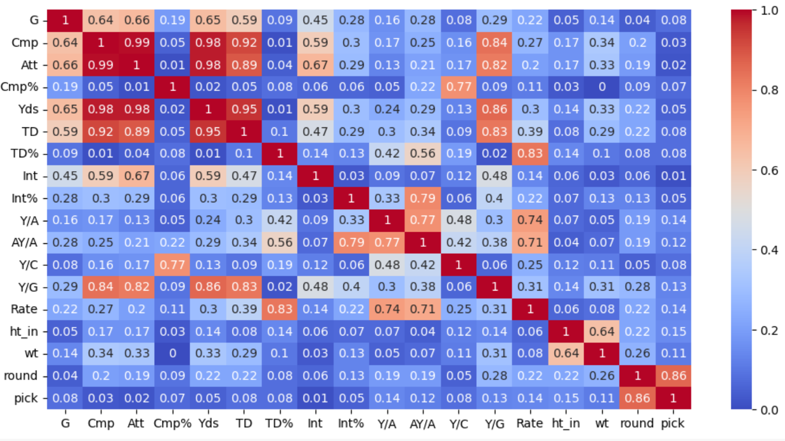
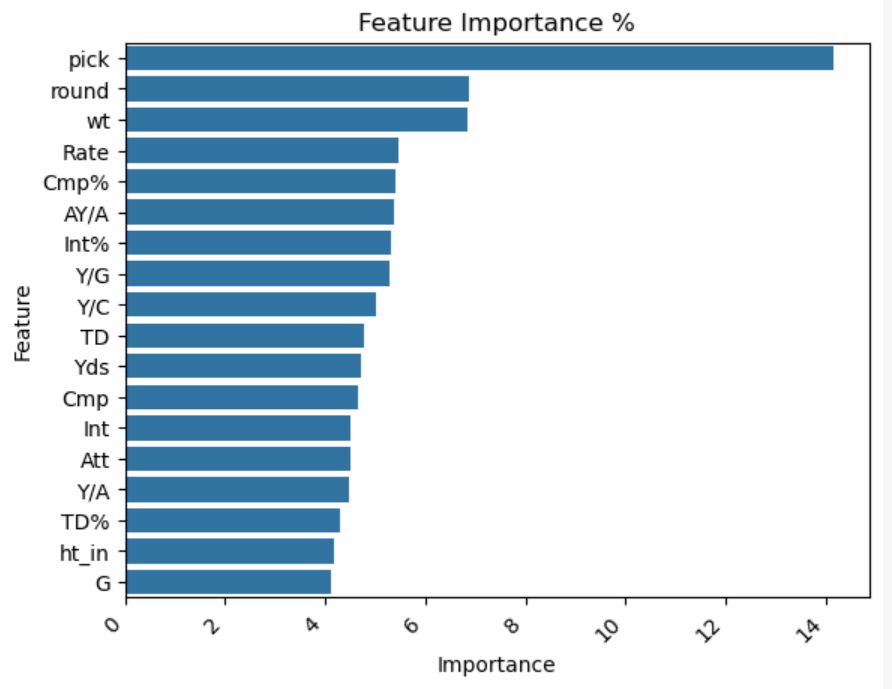
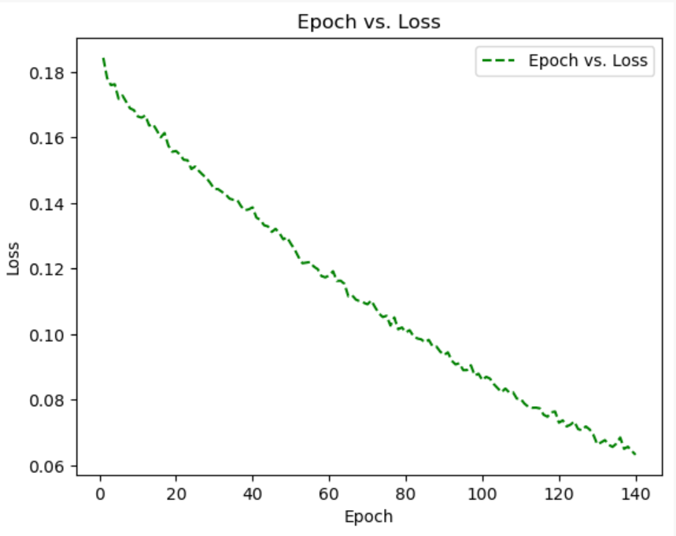
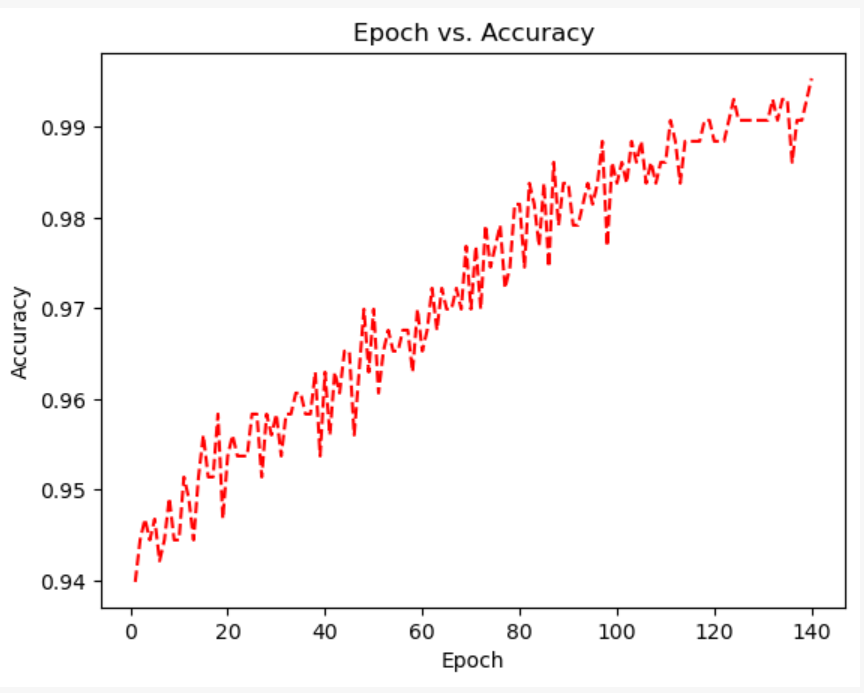
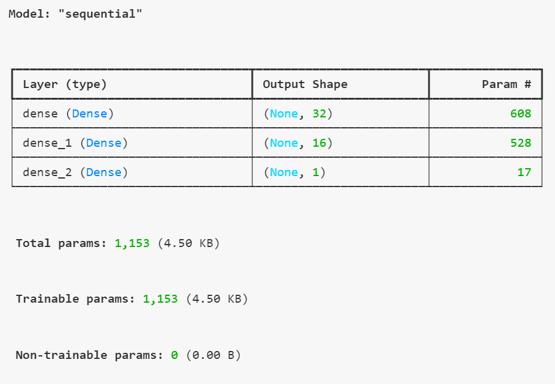
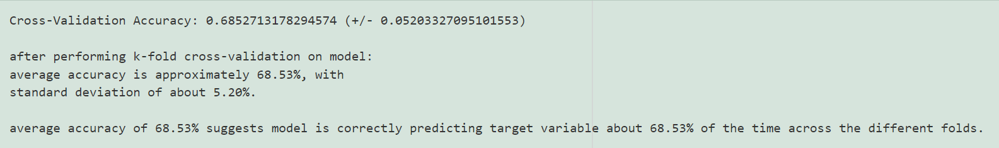

### Study

Predicting the success of NFL Quarterbacks, with emphasis on college performance, pre-draft rankings, and team investment in money and draft capital.

### Data Sources:

https://www.sports-reference.com/bot-traffic.html

The ultimate goal will be to determine which of those target/y are indicative of overall quarterback success (or can be investigated on their own) using the feature/X data from college football data.

classification problem since you're trying to categorize players as either successful (1) or not successful (0).

Target/y columns:

* **hof:** Hall of Fame induction
* **wins_succ:** win % > XX, 1 or more Superbowl wins),
* **award_succ:** Awards (Pro Bowl > 1, All Pro > 1)
* **stat_succ:** Statistical Success (passing_yards > 15,000, touchdown_passes > 50....)
* **earn_succ:** Earnings Success (career_earnings > $5M
* **long_succ:** Longevity success (years_played > 5 years)
* **nfl_agg_succ:** aggregate NFL success, based on combination of the aforementioned success targets.
  * eg.: nfl_agg_succ = 1 for any player with 1 in >= 2 or more of the other columns (stat_succ =1 and wins_succ = 1).

All columns will be binary (1, 0), ready-to-use as a target/y.  We will begin with NFL Aggregate Sucess target as well as perform branched/multi-prediction Neural Network models for multiple target/y columns.

Target/y Data

* FBref and Stathead sites more often than ten requests in a minute.
* our other sites more often than twenty requests in a minute.

##### Feature/X Data

To gather X features, we will gather the following data for college Quarterback prospects entering the NFL:

**Source**:

* Historical Draft Data: all QBs ever drafted.
* Take that list of QBs and fetch the QB data for all of them from pro-football-reference (ran that last night).  The search for the proper QB name is done much more thoroughly, double checking the name of the Quarterback fully before pulling data.
* Take that DataFrame, pull the list of QBs with valid data (over 600) and lookup their college stats at [sports-reference.com/cfb](http://sports-reference.com/cfb)  .

### Project Organization

* **sourcing_notebooks**: ipynb files that are used to source data
* **sourcing_artifacts**: results of the ipynb files in sourcing_notebooks, normally the `<notebook name>_output.pkl`.  `<notebook name>_output.csv`
* **cleaning_notebooks:** ipynb files used to clean the sourcing-output files.  resulting cleaned files will be placed in cleaning_artifacts folder with names: `<notebook name>_output.pkl`.  `<notebook name>_output.csv`
* **cleaning_artifacts:** results of the cleaned ipynb files from cleaning_notebooks
* **modeling_notebooks:** used to take combined and pre-processed data and apply modeling for the purpose of analysis and prediction
* **final_artifacts:** final files showing results of studies.

### Model Selection

Given the nature of the task - predicting success metrics - the focus will be on models that handle classification problems.

First/baseline models were **Logistic Regression** and **Random Forest Classifier.**

Also included was **Basic Neural Network (DNN)** Tensorflow/Keras model as there may be temporal dependencies in the data (value or state of one variable at a given time point influences the value or state of another variable at a future time point).

Practices utilized:

* **SimpleImputer()** in replacing missing or null/NA data.
* **Correlation analysis:** compute correlation matrix to identify highly correlated features
* **Feature Importance** (with Random Forest Model); calculate the feature importances and visualize with seaborn bar graph.
* **Feature Scaling** with StandardScaler to standardize/normalize numerical features (esp. important in the case of Logistic Regression and KNeighborsClassifier)
* **Visualizations** with seaborn, matplotlib
* **Hyperparameter Tuning** with GridSearchCV
* **K-Fold Cross-Validation** to assess performance of model across multiple subsets of the data; gives insights into how well model model generalizes.  Utilizes SciKeras **KerasClassifier** and Scikit-Learn **cross_val_score.**

Please See Appendix A, "Model Consideration and Selection" for a full list of the models reviewed, along with details of the characteristics.

### Future Modeling Suggestions

For expansion on these studies, the following is recommended as a starting point for future models and techniques:

Models:

* **Support Vector Machine**
* **LSTM (Long Short-Term Memory)**
* **K-Nearest Neighbors (KNN)**

Additional practices for future modeling:

* **Encoding Categorical Variables:**  explore categorical variables, requiring encoding (one-hot encoding, ordinal encoding).

### Modeling Process

###### I. Data Inspection, Cleaning

* Inspect Data
* Divide into X feature and y target DataFrames
* Handle N/A, NaN Values: eg. fillna() or **SimpleImputer()** to fill or remove NA values.

###### II. Exploratory Data Analysis (EDA)

The **target variable,** a 'success' value determined by applying numerical thresholds to statistics and metrics, as well as aggregating awards and honors (Pro-Bowl elections, Hall of Fame Indicutions), and career success (winning percentage, SuperBowl wins) were all of the nature of categorical classification.

* **Check **feature distributions**: determine if transformations are needed (log transformation for skewed data, etc.)**
* **Correlation analysis: compute correlation matrix** to identify highly correlated features, which can impact certain models; visualize with heat map.

* **Feature Importance** (with Random Forest Model); calculate the feature importances and visualize with seaborn bar graph.

* **Visualization** with seaborn, matlibplot.

  

  

###### III. Data Preparation, Split and Scale

* Train-Test Split (prepare data for model training and evaluation).
* **Standard Scaling** (ensure your features are on the same scale): StandardScaler()

###### IV. Modeling

* Model (create model)
* Fit (train model)
* Evaluate Training Model fit (accuracy_score/score on training data)
* Predict (accuracy_score/score)
* Evaluate Model (accuracy_score/score on y test data (actual data)  vs. predictions)
* K-Fold Cross-Validation to assess performance of model across multiple subsets of the data (utlizes KerasClassifier and Scikit-Learn cross_val_score)

###### V. Optimization / Hyperparameter Tuning

1. Grid Search

###### VI. Re-Model / Evaluate with Optimized Params/Methods/Hyperparameters

**Cross (K-Folds) Validation**

### Appendix A: Model Consideration and Selection

The following models were considered for the modeling and prediction of this dataset:

**Logistic Regression:**

* Good starting point for binary classification problems: simple and interpretable, making it a good baseline model.
* **Pros:** Simple and interpretable. Works well for binary classification. **Cons:** Limited to linear decision boundaries. **Best for** : Problems with linear relationships.

**Random Forest Classifier:**

* Robust ensemble method that works well for many classification tasks. It handles overfitting better than some other models and can manage a mix of numerical and categorical data
* **Pros:** Handles non-linear relationships.  Robust to outliers and overfitting. **Cons:** Less interpretable.  Can be slow for large datasets. **Best for:** Complex datasets with many features and interactions.

**K-Nearest Neighbors (KNN, KNeighborsClassifier):**

* Model can be effective if you have enough data. It makes predictions based on the nearest neighbors in the feature space. However, it can be sensitive to the choice of `k` and might struggle with high-dimensional data
* **Pros:** Simple and intuitive.  Non-parametric, flexible decision boundaries. **Cons:** Computationally intensive for large datasets. **Best for** : Small datasets with well-defined boundaries.

**Support Vector Machine (SVM) / Support Vector Classifier (SVC):**

* Can be powerful, especially with a non-linear kernel. It's effective for high-dimensional spaces but might require more tuning.
* **Pros:** Effective in high-dimensional spaces. Works well for clear margin of separation. **Cons:** Computationally intensive.  Requires careful tuning of hyperparameters. **Best for** : Medium-sized datasets with distinct class separability.

**Deep Neural Network (DNN):**

* A simple feedforward DNN can work well for structured data.  Ensure there is enough data to avoid overfitting, and tuning of hyperparameters is crucial.
* **Pros:** Flexible and can model complex relationships.  Scales well with large datasets. **Cons:** Requires more data. Can overfit without proper regularization. **Best for:** General use with non-linear relationships.

**Convolutional Neural Network (CNN)**:

* Generally used for image data, CNNs might not be the best fit for structured tabular data.
* **Pros:** Captures spatial hierarchies. Highly effective for image data. **Cons:** Computationally heavy. **Best for:** Image data, spatial data.

**LSTM (Long Short-Term Memory):**

* Designed for sequential data, such as time series or natural language; likely not appropriate for player statistics.
* **Pros:** Overcomes vanishing gradient issues. Captures long-term dependencies effectively.  **Cons:** Computationally heavy **Best for:** Long-term sequential data, time-series.

**Recurrent Neural Network (RNN)**

* Designed for sequential data, such as time series or natural language; likely not appropriate for player statistics.
* **Pros:** Captures temporal dependencies. Effective for time-series prediction. **Cons:** Vanishing gradient problems. **Best for:** Time-series data, sequential data.

### Other Studies

1. Excellent culling of NFL prospect data by Jack Lich, with highly clean datasets and feature descriptions available on both Kaggle [https://www.kaggle.com/datasets/jacklichtenstein/espn-nfl-draft-prospect-data](https://www.kaggle.com/datasets/jacklichtenstein/espn-nfl-draft-prospect-data) and github [https://github.com/jacklich10/nfl-draft-data](https://github.com/jacklich10/nfl-draft-data)
2. "Does Your NFL Team Draft to Win? New Research Reveals Rounds 3, 4, and 5 are the Key to Future On-Field Performance," Chandler Smith, [https://www.samford.edu/sports-analytics/fans/2024/Does-Your-NFL-Team-Draft-to-Win-New-Research-Reveals-Rounds-3-4-and-5-are-the-Key-to-Future-On-Field-Performance](https://www.samford.edu/sports-analytics/fans/2024/Does-Your-NFL-Team-Draft-to-Win-New-Research-Reveals-Rounds-3-4-and-5-are-the-Key-to-Future-On-Field-Performance)
3. "Using Machine Learning and College Profiles to Predict NFL Success," [Northwestern Sports Analytics Group](https://sites.northwestern.edu/nusportsanalytics/ "Northwestern Sports Analytics Group") [https://sites.northwestern.edu/nusportsanalytics/2024/03/29/using-machine-learning-and-college-profiles-to-predict-nfl-success/]()
4. "Predicting QB Success in the NFL," [Adam McCann](https://www.linkedin.com/in/adam-mccann-bb94774/), Chief Data Officer at KeyMe, [https://duelingdata.blogspot.com/2017/04/predicting-qb-success-in-nfl.html]()
5. "NFL Draft Day Dreams: Analyzing the Success of Drafted Players vs. Undrafted Free Agents," Breanna Wright and Major Bottoms Jr. [https://www.endava.com/insights/articles/nfl-draft-day-analyzing-the-success-of-drafted-players-vs-undrafted-free-agents]()
6. "Can the NFL Combine Predict Future Success?"  [https://nfldraftcombineanalysis.wordpress.com/2016/05/13/can-the-nfl-combine-predict-future-success/]()  Includes information about Combine Results and NFL Success, Combine Results and Draft Pick Position, Draft Pick Position and NFL Success, draft pick valuation (uses Jimmy Johnson's chart for pick valuation),
7. "Can NFL career success be predicted based on Combine results?" Caroline Malin-Mayor, Monica-Ann Mendoza, Victor Li, Tyler Devlin https://nfldraftcombineanalysis.wordpress.com/2016/05/03/52/  https://nfldraftcombineanalysis.wordpress.com/2016/04/27/11/
8. "Valuing the NFL Draft", Caroline Malin-Mayor, Monica-Ann Mendoza, Victor Li, Tyler Devlin https://nfldraftcombineanalysis.wordpress.com/2016/04/20/2/  Uses Weighted Career Approximate Value to label success metric.
