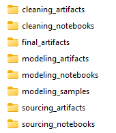

### Study

Predicting the xyz

### Data Sources:

* xyz

### Data File Organization

* **sourcing_notebooks**: ipynb files that are used to source data
* **sourcing_artifacts**: results of the ipynb files in sourcing_notebooks, normally the `<notebook name>_output.pkl`.  `<notebook name>_output.csv`
* **cleaning_notebooks:** ipynb files used to clean the sourcing-output files.  resulting cleaned files will be placed in cleaning_artifacts folder with names: `<notebook name>_output.pkl`.  `<notebook name>_output.csv`
* **cleaning_artifacts:** results of the cleaned ipynb files from cleaning_notebooks
* **modeling_notebooks:** used to take combined and pre-processed data and apply modeling for the purpose of analysis and prediction
* **final_artifacts:** final files showing results of studies.

    

### Target/y Data

The goal will be to determine...

Target/y columns:

* **var_1**
* **var_2**
* ...

All columns will be of type... 

**Source**:

### Feature/X Data

To gather X features...

**Source**:

### Modeling Process

#### I. Data Preparation

1. Investigate Data
2. Handle NA Values: SimpleImputer() to fill or remove NA values.
3. Compute Correlation Matrix ()  (before scaling to keep original values intact for more accurate correlation matrix).
4. Train-Test Split (prepare data for model training and evaluation).
5. Standard Scaling (ensure your features are on the same scale): StandardScaler()

#### II. Modeling

1. Model (create model)
2. Fit (train model)
3. Evaluate Training Model fit (accuracy_score/score on training data)
4. Predict (accuracy_score/score)
5. Evaluate Model (accuracy_score/score on y test data (actual data)  vs. predictions)

#### III. Optimization / Hyperparameter Tuning

1. Grid Search

#### IV. Re-Model / Evaluate with Optimized Params/Methods/Hyperparameters

#### Other Studies

1. www.
